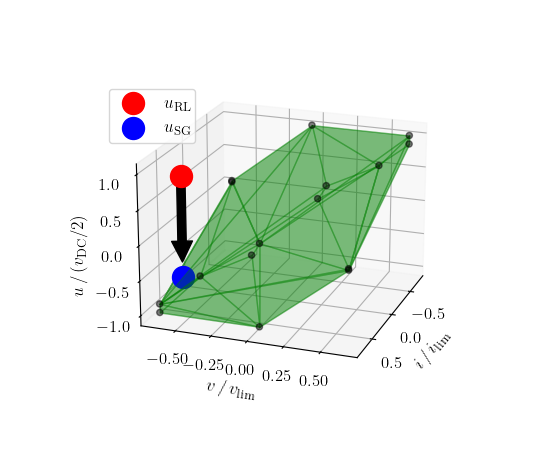

# Safe-Reinforcement-Learning-Based-Control-in-Power-Electronic-Systems
[Read the Paper](https://ieeexplore.ieee.org/document/10182718)

Data-driven approaches such as reinforcement learning (RL) allow a controller design without a priori system knowledge with minimal human effort as well as seamless self-adaptation to varying system characteristics.
However, RL does not inherently consider input and state constraints, i.e., satisfying safety-relevant system limits during training and test.
This is challenging in power electronic systems where it is necessary to avoid overcurrents and -voltages. 
To overcome this issue, a standard reinforcement learning algorithm can be extended by a combination of constraint optimal control and online model identification to ensure safety during and after the learning process.
This is applied to an electrical power grid application utilizing a three-level voltage source inverter with an LC filter.

The [OpenModelica Microgrid Gym toolbox](https://github.com/upb-lea/openmodelica-microgrid-gym) 
is used to model the control plant.

The challenge regarding safety is to validate action chosen by the RL agent that satisfies the bounds for all future states. 
Such a state-action pair is called feasible.
In the figure below the feasible set of the plant unter investiagtion is highlighted by the green shaded polytope.
All states and action pairs inside the green region are within the feasible set (e.g., the blue point, but not the red).

This validation is used to ensure safety in RL-based control in power electronic systems.

For more details see paper.

Suggestions or experiences concerning application are welcome!
